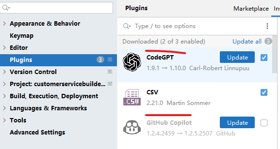
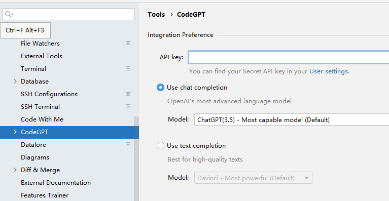
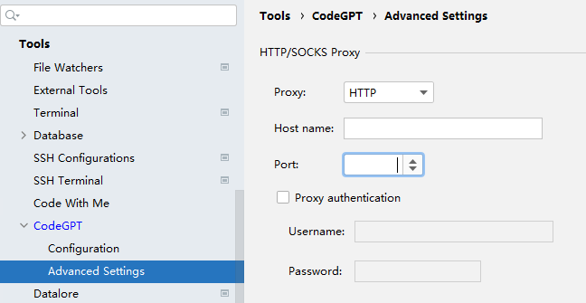
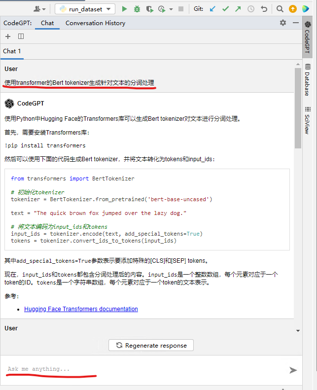
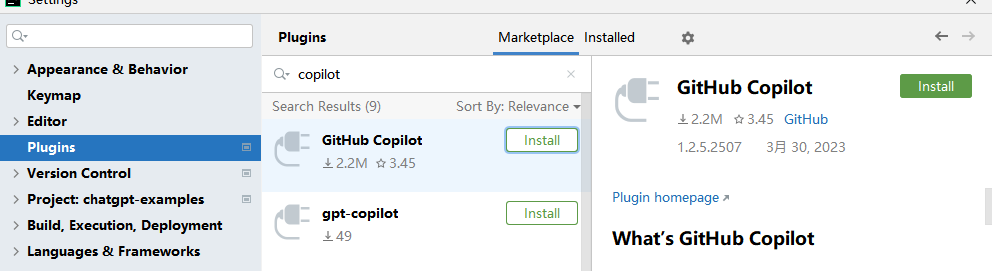
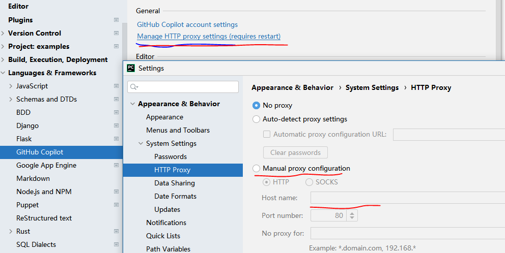
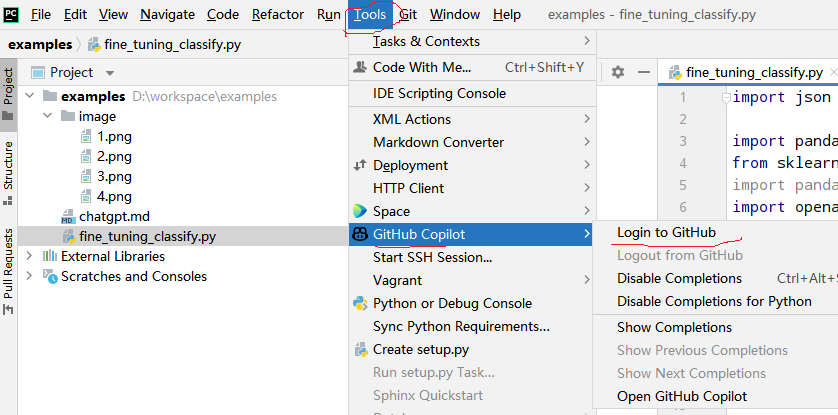
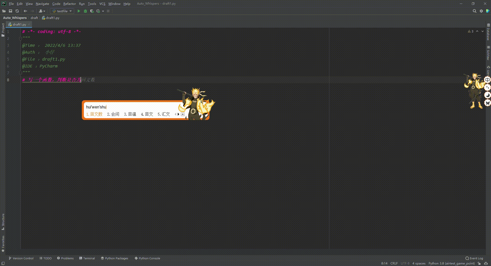

## 在pycharm,idea，goland等使用chatgpt生成代码

### 安装插件 codeGPT

### 在菜单Tool -> CodeGPT中配置openai key，选择对应模型以及模型消息模式

### 在菜单Tool -> CodeGPT -> Advanced Setting 中配置代理，如果无需代理直连可省略

### 重新回到UI，在右侧打开CodeGPT，输入“使用Transformer的Bert Tokenizer生成正对文本的分词处理”，显示如下:

### 安装插件 GitHub Copilot

### 设置GitHub Copilot代理，如果无需代理则跳过

### 使用Github账户登录，需要绑定信用卡的账户

### 使用Copilot生成代码流程

1. 先写注释，然后Return键就会给出智能建议代码
2. 按下Tab键，会选中该建议，然后会有新的建议代码出现
3. 如果符合工程需求就继续按Tab键，比如我们按下四次Tab键后得到如下结果

4. 

